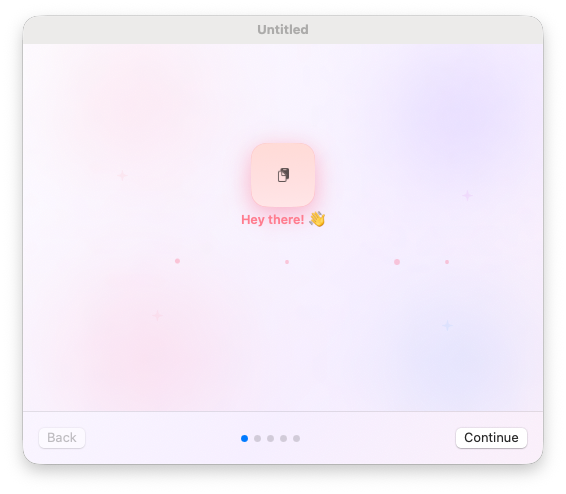
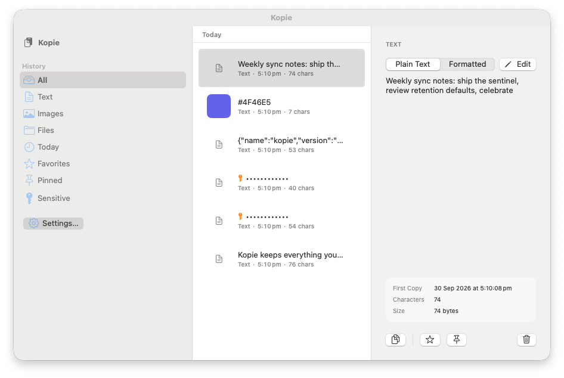
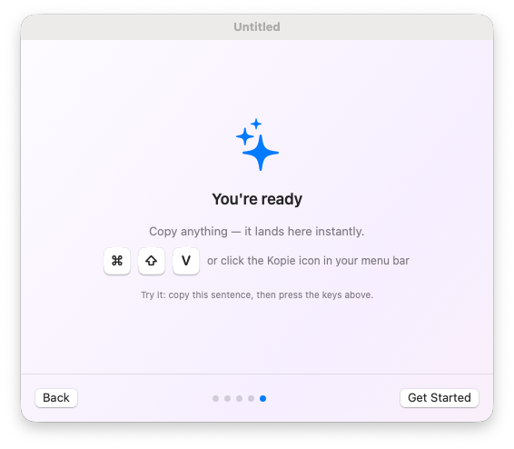
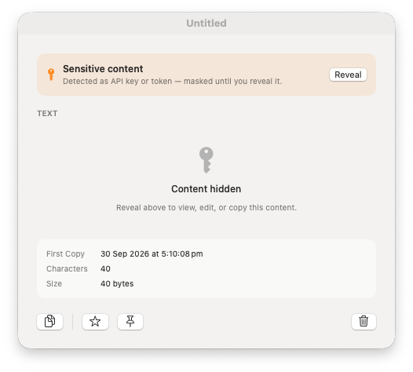
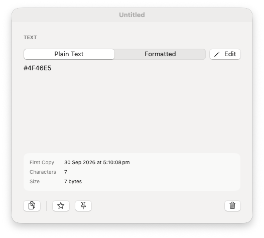

# Kopie

<p align="center">
  
</p>

Native macOS clipboard manager — menu-bar first, fast, local-only.
Copy something, find it later, paste it back.

<p align="center">
  
</p>

## Screenshots

| | |
|---|---|
|  |  |
| *Onboarding ends by teaching the hotkey* | *Sentinel masks a detected API token until revealed* |
|  | |
| *Copied colors become swatches with Copy HEX / RGB / HSL* | |

## Why Kopie?

- **Private by design** — your clipboard never leaves your Mac. No cloud, no accounts, no telemetry.
- **Fast** — menu-bar and keyboard first, opens instantly, searches as you type.
- **Native** — Swift + SwiftUI, no third-party dependencies.
- **Open source** — the whole app is public on [GitHub](https://github.com/Perigrino/Kopie). Read the code, verify exactly what it does with your clipboard, and contribute.

## Features

- Captures text and images copied anywhere on your Mac
- Live search with day-grouped history, sidebar filters, and image thumbnails
- Copy-back via global hotkey (`⌘⇧V`), direct paste (`⌥↩`), quick-select (`⌥1`–`⌥9`)
- OCR — find screenshots by the words inside them (fully on-device)
- Paste as plain text (`⌃` while copying)
- Formatted viewer with syntax highlighting (JSON, HTML, SQL, Swift, …) and rich-text rendering
- Inline editing (`⌘E`), favorites, multi-select delete, paste queue
- Shortcuts / Siri app intents; retention cleanup with favorites protected
- Ignore-list for sensitive apps; on-device notifications for pause/clear

## Requirements

macOS 13 Ventura or later.

## Development

```bash
swift test        # core engine unit tests (or: npm test)
npm run dev       # debug build + assemble + open Kopie.app
npm run build     # release build (dist/Kopie.app)
npm run package   # release build + dist/Kopie.dmg
bash scripts/acceptance.sh   # headless full workflow
```

Ad-hoc signed by default; set `KOPIE_SIGN_IDENTITY` before `npm run package` to Developer-ID sign.
